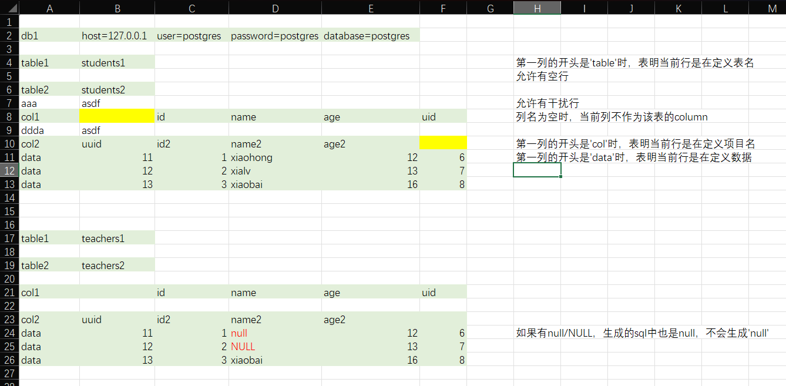

# Excel to SQL

A lightweight VS Code extension that converts tab-separated data copied from Excel into SQL `INSERT` statements.

Designed for quick testing and data seeding.

---

## Usage

1. Copy data from Excel
2. Paste it into any file in VS Code
3. Select the pasted text
4. Right click → **Convert Excel to SQL**

The generated SQL will open in a new untitled editor.

---

## Rules
- Lines starting with db define database connection info
Format: db{index}\thost=...\tuser=...\tpassword=...\tdatabase=...\tport=...

- Lines starting with table define target table name
Format: table{index}\t<tablename>

- Lines starting with col define column names (tab separated)
Format: col{index}\tcol1\tcol2\tcol3...

- Lines starting with data define one row of values (tab separated)
Each data line represents a single record

- {index} is used to bind db / table / col / data together
(e.g. db1, table1, col1, data1 belong to the same group)

- Multiple data lines are collected as multiple rows until the next block

- Column names that are empty ('') are ignored entirely
(both column and corresponding values will be removed)

- Value handling:

    - null / NULL (case-insensitive) → SQL NULL

    - Empty cell → empty string ''

    - Other values → quoted strings with single-quote escaping
    (' becomes '')

---

## Supported Format1

```text
table	students1				
col	id	name	age	uid
data	1	xiaohong	12	6
data	2	xialv	13	7
data	3	xiaobai	16	8
			
table	students2				
col	id	name	age	uid
data	1	xiaohong	12	6
data	2	xialv	13	7
data	3	xiaobai	16	8

```

## Example Output1
```sql

INSERT INTO students1 (id, name, age, uid) VALUES
('1', 'xiaohong', '12', '6'),
('2', 'xialv', '13', '7'),
('3', 'xiaobai', '16', '8');
INSERT INTO students2 (id, name, age, uid) VALUES
('1', 'xiaohong', '12', '6'),
('2', 'xialv', '13', '7'),
('3', 'xiaobai', '16', '8');

```

## Supported Format2


```text
					
db1	host=127.0.0.1	user=postgres	password=postgres	database=postgres	
					
table1	students1				
					
table2	students2				
aaa	asdf				
col1		id	name	age	uid
ddda	asdf				
col2	uuid	id2	name2	age2	
data	11	1	xiaohong	12	6
data	12	2	xialv	13	7
data	13	3	xiaobai	16	8
					
					
					
table1	teachers1				
					
table2	teachers2				
					
col1		id	name	age	uid
					
col2	uuid	id2	name2	age2	
data	11	1	null	12	6
data	12	2	NULL	13	7
data	13	3	xiaobai	16	8

```

## Example Output2
```sql
INSERT INTO students1 (id, name, age, uid) VALUES
('1', 'xiaohong', '12', '6'),
('2', 'xialv', '13', '7'),
('3', 'xiaobai', '16', '8');
INSERT INTO teachers1 (id, name, age, uid) VALUES
('1', NULL, '12', '6'),
('2', NULL, '13', '7'),
('3', 'xiaobai', '16', '8');


INSERT INTO students2 (uuid, id2, name2, age2) VALUES
('11', '1', 'xiaohong', '12'),
('12', '2', 'xialv', '13'),
('13', '3', 'xiaobai', '16');
INSERT INTO teachers2 (uuid, id2, name2, age2) VALUES
('11', '1', NULL, '12'),
('12', '2', NULL, '13'),
('13', '3', 'xiaobai', '16');
```


## Installation From VS Code Marketplace or manually:
`code --install-extension excel-to-sql.vsix`

## Development
```cmd
npm install
npm run compile
vsce package
```